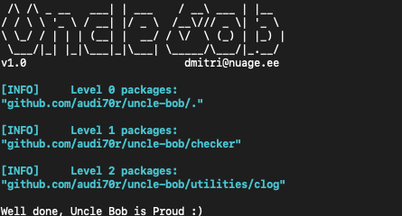

# Uncle-bob
Golang clean architecture linter


# Description

A golang linter based on Uncle Bob's clean code concepts.

The linter builds a hierarchical model from the project directory AST and assign a level for every 
package used by the project (with the exception of a standart golang library). The dependency 
levels are defined as 

Linter works go mod enabled

# Usage

Build the project
```bash
$ go build
```

Install the linter on Linux
```bash
$ go install
```

For running uncle bob, go to the project root directory, 
where the go.mod is located and simply run
```bash
$ uncle-bob
```



Usage of uncle-bob:


To ignore test files
```bash
$ uncle-bob -ignore-tests
```

show detailed information about package imports
```bash
$ uncle-bob -package-imports=github.com/audi70r/uncle-bob/checker
``` 

-strict - do strict checking, allow only one level inward imports

# License
Do whatever you want with it, but don't disrespect Uncle Bob!